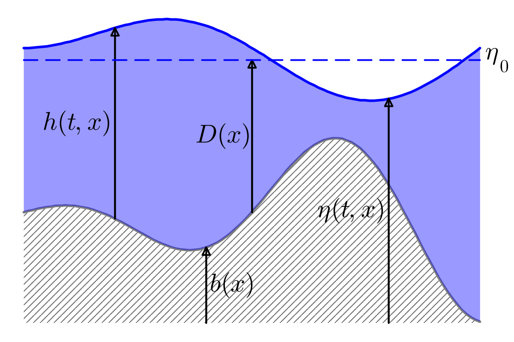

# Running a simulation

## Introduction

In this tutorial we describe how to numerically solve the BBM-BBM (Benjamin-Bona-Mahony) equations with variable bottom topography in one dimension, which has been proposed in [^IsrawiKalischKatsaounisMitsotakis2021] for two spatial dimensions. The equations describe a dispersive shallow water model, i.e. they extend the well-known shallow water equations in the sense that dispersion is modeled. The shallow water equations are a system of first order hyperbolic partial differential equations that can be written in the form of a balance law. In contrast, the BBM-BBM equations additionally include third-order mixed derivatives. In primitive variables ``q = (\eta, v)`` they can be written as:

```math
\begin{aligned}
  \eta_t + ((\eta + D)v)_x - \frac{1}{6}(D^2\eta_{xt})_x &= 0,\\
  v_t + g\eta_x + \left(\frac{1}{2}v^2\right)_x - \frac{1}{6}(D^2v_t)_{xx} &= 0.
\end{aligned}
```

Here, ``\eta = h + b`` describes the total water height, ``h`` the water height above the bottom topography (bathymetry), ``b = -D`` the bathymetry and ``v`` the velocity in horizontal direction. The gravitational acceleration is denoted as ``g``. A sketch of the water height and the bathymetry can be found below.



In order to conduct a numerical simulation with DispersiveShallowWater.jl, we perform the following steps.

First, we load the necessary libraries:

```@example overview
using DispersiveShallowWater, OrdinaryDiffEq
```

## Define physical setup

As a first step of a numerical simulation, we define the physical setup we want to solve. This includes the set of equations, potentially including physical parameters, initial and boundary conditions as well as the domain. In the following example, the initial condition describes a travelling wave that moves towards a beach, which is modeled by a linearly increasing bathymetry.

```@example overview
equations = BBMBBMVariableEquations1D(gravity_constant = 9.81)

function initial_condition_shoaling(x, t, equations::BBMBBMVariableEquations1D, mesh)
    A = 0.07 # amplitude of wave
    x0 = -30 # initial center
    eta = A * exp(-0.1*(x - x0)^2)
    v = 0
    D = x <= 0.0 ? 0.7 : 0.7 - 1/50 * x
    return SVector(eta, v, D)
end

initial_condition = initial_condition_shoaling
boundary_conditions = boundary_condition_periodic

coordinates_min = -130.0
coordinates_max = 20.0
N = 512
mesh = Mesh1D(coordinates_min, coordinates_max, N + 1)
```

The first line specifies that we want to solve the BBM-BBM equations with variable bathymetry using a gravitational acceleration ``g = 9.81``. Afterwards, we define the initial condition, which is described as a function with the spatial variable `x`, the time `t`, the `equations` and a `mesh` as parameters. If an analytical solution is available, the time variable `t` can be used, and the initial condition can serve as an analytical solution to be compared with the numerical solution. Otherwise, you can just keep the time variable unused. An initial condition in DispersiveShallowWater.jl is supposed to return an `SVector` holding the values for each of the unknown variables. Since the bathymetry is treated as a variable (with time derivative 0) for convenience, we need to provide the value for the primitive variables `eta` and `v` as well as for `D`.

Next, we choose periodic boundary conditions since, up to now, DispersiveShallowWater.jl only provides support for this type of boundary conditions. Lastly, we define the physical domain as the interval from -130 to 20 and we choose 512 intermediate nodes. The mesh is homogeneous, i.e. the distance between each two nodes is constant. We choose the left boundary very far to the left in order to avoid an interaction of the left- and right-travelling waves.

## Define numerical solver

In the next step, we build a [`Semidiscretization`](@ref) that bundles all ingredients for the spatial discretization of the model. Especially, we need to define a [`Solver`](@ref). The simplest way to define a solver is to call the constructor by providing the mesh and a desired order of accuracy. In the following example, we use an accuracy order of 4. The default constructor simply creates periodic first- and second-derivative central finite difference summation by parts operators of the provided order of accuracy. How to use other summation by parts operators, is described in the section on [how to customize the solver](@ref customize_solver).

```@example overview
solver = Solver(mesh, 4)

semi = Semidiscretization(mesh, equations, initial_condition, solver, boundary_conditions = boundary_conditions)
```

Finally, we put the `mesh`, the `equations`, the `initial_condition`, the `solver` and the `boundary_conditions` together in a semidiscretization `semi`.

## Solve system of ordinary differential equations

Once we have obtained a semidiscretization, we can solve the resulting system of ordinary differential equations. To do so, we specify the time interval that we want to simulate and obtain an `ODEProblem` from the [SciML ecosystem for ordinary differential equations](https://diffeq.sciml.ai/latest/) by calling [`semidiscretize`](@ref) on the semidiscretization and the time span. Additionally, we can analyze the numerical solution using an [`AnalysisCallback`](@ref). The analysis includes computing the ``L^2`` error and ``L^\infty`` error of the different solution's variables compared to the initial condition (or, if available, at the same time analytical solution). Additional errors can be passed by the keyword argument `extra_analysis_errors`. Additional integral quantities that should be analyzed can be passed by keyword argument `extra_analysis_integrals`. In this example we pass the `conservation_error`, which computes the temporal change of the total amount (i.e. integral) of the different variables over time. In addition, the integrals of the total waterheight ``\eta`` [`waterheight_total`](@ref), the [`velocity`](@ref) and the [`entropy`](@ref) are computed and saved for each time step. The total waterheight and the total velocity are linear invariants of the BBM-BBM equations, i.e. they do not change over time. The total entropy

```math
\mathcal E(t; \eta, v) = \frac{1}{2}\int_\Omega g\eta^2 + (\eta + D)v^2\textrm{d}x
```

is a nonlinear invariant and should be constant over time as well. During the simulation, the `AnalysisCallback` will print the results to the terminal.

Finally, the `ode` can be `solve`d using the interface from [OrdinaryDiffEq.jl](https://github.com/SciML/OrdinaryDiffEq.jl). This means, we can specify a time-stepping scheme we want to use the tolerances for the adaptive time-stepping and the time values, where the solution values should be saved. In this case, we use the adaptive explicit Runge-Kutta method `Tsit5` by Tsitouras of order 5(4). Here, we save the solution at 100 equidistant points.

```@example overview
tspan = (0.0, 25.0)
ode = semidiscretize(semi, tspan)
analysis_callback = AnalysisCallback(semi; interval = 10,
                                     extra_analysis_errors = (:conservation_error,),
                                     extra_analysis_integrals = (waterheight_total,
                                                                 velocity, entropy),
                                     io = devnull)
callbacks = CallbackSet(analysis_callback)

saveat = range(tspan..., length = 100)
sol = solve(ode, Tsit5(), abstol = 1e-7, reltol = 1e-7,
            save_everystep = false, callback = callbacks, saveat = saveat)
```

After solving the equations, `sol` contains the solution for each of the three variables at every spatial point for each of the 100 points in time. The errors and integrals recorded by the `AnalysisCallback` can be obtained as `NamedTuple`s by [`errors(analysis_callback)`](@ref) and [`integrals(analysis_callback)`](@ref).

## [Visualize results](@id visualize_results)

After running the simulation, the results can be visualized using [Plots.jl](https://github.com/JuliaPlots/Plots.jl), which needs to be imported first. Then, we can plot the solution at the final time by calling `plot` on a `Pair` of the `Semidiscretization` and the corresponding `ODESolution` `sol`. The result is depicted in the following picture.

```@example overview
using Plots

plot(semi => sol)
savefig("shoaling_solution.png")
```


By default, this will plot the bathymetry, but not the initial (analytical) solution. You can adjust this by passing the boolean values `plot_bathymetry` (if `true` always plot to first subplot) and `plot_initial`. You can also provide a `conversion` function that converts the solution. A conversion function should take the values of the primitive variables `q` at one node, and the `equations` as input and should return an `SVector` of any length as output. For a user defined conversion function, there should also exist a function `varnames(conversion, equations)` that returns a `Tuple` of the variable names used for labelling. The conversion function can, e.g., be [`prim2cons`](@ref) or [`waterheight_total`](@ref) if one only wants to plot the total waterheight. The resulting plot will have one subplot for each of the returned variables of the conversion variable. By default, the conversion function is just [`prim2prim`](@ref), i.e. the identity.

Plotting an animation over time can, e.g., be done by the following command, which uses `step` to plot the solution at a specific time step.

```@example overview
anim = @animate for step in 1:length(sol.u)
    plot(semi => sol, plot_initial = true, conversion = waterheight_total, step = step, xlim = (-50, 20), ylims = [(-0.8, 0.1)])
end
gif(anim, "shoaling_solution.gif", fps = 25)
```

It is also possible to plot the solution variables at a fixed spatial point over time by calling `plot(semi => sol, x)` for some `x`-value, see [plot_examples.jl](https://github.com/JoshuaLampert/DispersiveShallowWater.jl/blob/main/visualization/plot_examples.jl) for some examples.

Often, it is interesting to have a look at how the quantities that are recorded by the `AnalysisCallback` evolve in time. To this end, you can `plot` the `AnalysisCallback` by

```@example overview
plot(analysis_callback)
savefig("analysis_callback.png")
```

This creates the following figure:


You can see that the linear invariants ``\int_\Omega\eta\textrm{d}x`` and ``\int_\Omega v\textrm{d}x`` are indeed conserved exactly. The entropy, however, starts growing at around ``t = 17``  and rises up to approximately ``5e-5``. This is because of the fact that, during the time integration, a nonlinear invariant is not necessarily conserved, even if the semidiscretization conserves the quantity exactly. How to obtain a fully-discrete structure-preserving numerical scheme is explained in the following section.

## Use entropy-conserving time integration

To obtain entropy-conserving time-stepping schemes DispersiveShallowWater.jl uses the relaxation method introduced in [^Ketcheson2019] and further developed in [^RanochaSayyariDalcinParsaniKetcheson2020]. The relaxation method is implemented as a [`RelaxationCallback`](@ref), which takes a function representing the conserved quantity as the keyword argument `invariant`. Therefore, we can run the same example as above, but using relaxation on the entropy by simply adding another callback to the `CallbackSet`:

```@example overview
analysis_callback = AnalysisCallback(semi; interval = 10,
                                     extra_analysis_errors = (:conservation_error,),
                                     extra_analysis_integrals = (waterheight_total,
                                                                 velocity, entropy),
                                     io = devnull)
relaxation_callback = RelaxationCallback(invariant = entropy)
callbacks = CallbackSet(relaxation_callback, analysis_callback)
sol = solve(ode, Tsit5(), abstol = 1e-7, reltol = 1e-7,
            save_everystep = false, callback = callbacks, saveat = saveat)
```

When you use both, an `AnalysisCallback` and a `RelaxationCallback`, note that the `relaxation_callback` needs to come first inside the `CallbackSet` as it needs to be invoked prior to the `analysis_callback`, such that the `analysis_callback` analyzes the solution with the already updated values.

Plotting the `analysis_callback` again, we can see that now also the `entropy` is conserved up to machine precision.

```@example overview
plot(analysis_callback)
savefig("analysis_callback_relaxation.png")
```


## [Customize solver](@id customize_solver)

In the semidiscretization created above, we used the default SBP operators, which are periodic finite difference operators. Using different SBP operators for the semidiscretization can be done leveraging [SummationByPartsOperators.jl](https://github.com/ranocha/SummationByPartsOperators.jl/), which needs to be imported first:

```@example overview
using SummationByPartsOperators: legendre_derivative_operator, UniformPeriodicMesh1D, couple_discontinuously, PeriodicUpwindOperators
```

As an example, let us create a semidiscretization based on discontinuous Galerkin (DG) upwind operators. A semidiscretization implemented in DispersiveShallowWater.jl needs one first-derivative and one second-derivative SBP operator. To build the first-derivative operator, we first create a `LegendreDerivativeOperator` with polynomial degree 3 on a reference element `[-1.0, 1.0]` and a `UniformPeriodicMesh1D` for the coupling.

```@example overview
mesh = Mesh1D(coordinates_min, coordinates_max, N)
accuracy_order = 4
D_legendre = legendre_derivative_operator(-1.0, 1.0, accuracy_order)
uniform_mesh = UniformPeriodicMesh1D(mesh.xmin, mesh.xmax, div(mesh.N, accuracy_order))
```

Upwind DG operators in negative, central and positive operators can be obtained by `couple_discontinuously`

```@example overview
central = couple_discontinuously(D_legendre, uniform_mesh)
minus = couple_discontinuously(D_legendre, uniform_mesh, Val(:minus))
plus = couple_discontinuously(D_legendre, uniform_mesh, Val(:plus))
D1 = PeriodicUpwindOperators(minus, central, plus)
```

In order to still have an entropy-conserving semidiscretization the second-derivative SBP operator needs to be

```@example overview
using SparseArrays: sparse
D2 = sparse(plus) * sparse(minus)
```

The [`Solver`](@ref) object can now be created by passing the two SBP operators to the constructor, which, in turn, can be used to construct a `Semidiscretization`:

```@example overview
solver = Solver(D1, D2)
semi = Semidiscretization(mesh, equations, initial_condition, solver, boundary_conditions = boundary_conditions)
```

As before, we can run the simulation by

```@example overview
analysis_callback = AnalysisCallback(semi; interval = 10,
                                     extra_analysis_errors = (:conservation_error,),
                                     extra_analysis_integrals = (waterheight_total,
                                                                 velocity, entropy),
                                     io = devnull)
relaxation_callback = RelaxationCallback(invariant = entropy)
callbacks = CallbackSet(relaxation_callback, analysis_callback)
sol = solve(ode, Tsit5(), abstol = 1e-7, reltol = 1e-7,
            save_everystep = false, callback = callbacks, saveat = saveat)
anim = @animate for step in 1:length(sol.u)
    plot(semi => sol, plot_initial = true, conversion = waterheight_total, step = step, xlim = (-50, 20), ylims = [(-0.8, 0.1)])
end
gif(anim, "shoaling_solution_dg.gif", fps = 25)
```

For more details see also the [documentation of SummationByPartsOperators.jl](https://ranocha.de/SummationByPartsOperators.jl/stable/)

## Additional resources

Some more examples sorted by the simulated equations can be found in the [examples/](https://github.com/JoshuaLampert/DispersiveShallowWater.jl/tree/main/examples) subdirectory. Especially, in [examples/svaerd\_kalisch\_1d/](https://github.com/JoshuaLampert/DispersiveShallowWater.jl/tree/main/examples/svaerd_kalisch_1d) you can find Julia scripts that solve the [`SvaerdKalischEquations1D`](@ref) that were not covered in this tutorial. The same steps as described above, however, apply in the same way to these equations. Attention must be paid for these equations because they do not conserve the classical total entropy ``\mathcal E``, but a modified entropy ``\hat{\mathcal E}``, available as [`entropy_modified`](@ref).

More examples, especially focussing on plotting, can be found in the scripts [create_figures.jl](https://github.com/JoshuaLampert/DispersiveShallowWater.jl/blob/main/visualization/create_figures.jl) and [plot_examples.jl](https://github.com/JoshuaLampert/DispersiveShallowWater.jl/blob/main/visualization/plot_examples.jl).

## References

[^IsrawiKalischKatsaounisMitsotakis2021]:
    Israwi, Kalisch, Katsaounis, Mitsotakis (2021).
    A regularized shallow-water waves system with slip-wall boundary conditions in a basin: theory and numerical analysis.
    [DOI: 10.1088/1361-6544/ac3c29](https://doi.org/10.1088/1361-6544/ac3c29)

[^Ketcheson2019]:
    Ketcheson (2019):
    Relaxation Runge-Kutta Methods: Conservation and stability for Inner-Product Norms.
    [DOI: 10.1137/19M1263662](https://doi.org/10.1137/19M1263662)

[^RanochaSayyariDalcinParsaniKetcheson2020]:
    Ranocha, Sayyari, Dalcin, Parsani, Ketcheson (2020):
    Relaxation Runge–Kutta Methods: Fully-Discrete Explicit Entropy-Stable Schemes for the Compressible Euler and Navier–Stokes Equations
    [DOI: 10.1137/19M1263480](https://doi.org/10.1137/19M1263480)

